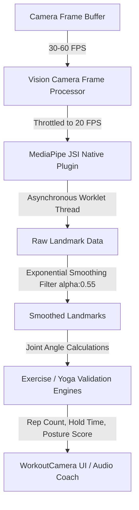

# Exercise Buddy - Mobile Client

Exercise Buddy is a premium, real-time interactive fitness and yoga companion app built on **React Native** and **Expo**. It uses the device camera to analyze body posture, count reps, validate yoga poses, and guide the user with a 3D animated avatar coach and real-time audio feedback.

---

## 🚀 Tech Stack

The application leverages a modern mobile ecosystem tailored for high-performance graphics and machine learning inference:

### Core Frameworks
* **React Native (v0.81.5) & Expo (v54.0.34)**: Managed workspace with custom native code integrations.
* **Expo Router (v6.0.23)**: File-based routing for robust multi-screen navigation.
* **TypeScript (v5.9.2)**: Strict type safety throughout components, hooks, and engines.
* **Zustand (v5.0.14)**: Fast, lightweight state management.

### Machine Learning & Camera Processing
* **React Native Vision Camera (v4.7.2)**: High-performance camera module supporting Custom JSI Frame Processors.
* **Custom JSI MediaPipe Plugin (`mediapipe-pose`)**: Native Kotlin/Java wrapper executing MediaPipe Pose Landmark models directly on the camera frame buffer.
* **React Native Worklets**: Execution context to run heavy pose estimation calculations asynchronously off the main React Native rendering thread.

### 3D Graphics & Animations
* **Three.js & @react-three/fiber/native (v9.6.1)**: WebGL-based native 3D renderer for rendering high-fidelity rigged avatars on screen.
* **@react-three/drei/native (v10.7.7)**: Helper utilities for canvas setup, outlines, and lighting.
* **React Native Reanimated (v4.1.1)**: Smooth, GPU-accelerated UI animations (e.g. breathing overlays, custom gauges).
* **Lottie React Native (v7.3.8)**: High-quality vector animations for achievement and summary screens.

### Audio Systems
* **expo-speech & react-native-tts**: Speech synthesizer outputting real-time voice corrections and feedback during active sets.

---

## 📁 Directory Structure (under `/mobile`)

```
mobile/
├── app/                        # Expo Router Pages
│   ├── (tabs)/                 # Main dashboard and navigation layout
│   ├── workout/                # Workout active screens & overlays
│   │   ├── BreathingOverlay.tsx # Animated breath guide rest screen
│   │   ├── RestOverlay.tsx      # Standard rest screen
│   │   ├── WorkoutCamera.tsx    # Live session stats, rep rings & controls
│   │   └── Warmupoverlay.tsx    # Interactive warmup guide
│   ├── camera.tsx              # Core camera tracking page
│   ├── CameraCheckScreen.tsx   # Pre-session camera angle validation
│   └── ...
├── components/                 # Reusable UI Components
│   ├── Avatar/                 # 3D Avatar Coach files
│   │   ├── AvatarModel.tsx     # Rigid GLB canvas rendering loader
│   │   └── CoachAvatar.tsx     # ThreeJS Canvas & Sparkles component
│   └── dashboard/              # Home & workout selecting lists
├── hooks/                      # Custom React Hooks
│   ├── usePoseDetection.ts     # Throttled, smoothed landmark provider
│   ├── usePoseValidation.ts    # Yoga posture evaluation hook
│   └── useExerciseEngine.ts    # Workout rep & metrics controller
├── lib/                        # Core Engine & Mathematics
│   └── exercise-engine/        # Joint angle calculations & reps counter
│       ├── rep-counter/        # Specific algorithms (Squat, Pushup, Plank, etc.)
│       └── landmark-extraction/# Landmark constants & converters
├── assets/                     # App media
│   └── avatar/coach.glb        # Rigged 3D avatar with baked animations
└── tsconfig.json               # TypeScript path alias configuration
```

---

## 🔄 Core Data Pipelines



### 1. Camera & ML Inference Pipeline
* **Frame Throttling**: The raw camera stream (30-60fps) is throttled inside `usePoseDetection` to **20 FPS** (`DETECTION_TARGET_FPS = 20`) to save CPU cycles and prevent overheating.
* **Off-Thread Processing**: Using `runAsync` (worklets), native MediaPipe JSI inference runs entirely in the background, keeping the camera preview animation at a locked 60fps.
* **Landmark Smoothing**: To combat joint jitter, landmarks are processed through a custom exponential moving average filter (`SMOOTHING_ALPHA = 0.55`). Large jumps are capped (`MAX_JUMP_PER_FRAME = 0.35`) to ignore tracking failures.

### 2. Validation & Rep Counter Engines
* **Workout Engine**: Calculates joint angles using trigonometric functions (e.g. hip-knee angle for squats). Translates raw values into workout states (`down` -> `up` -> `counted`).
* **Yoga Engine**: Compares smoothed user coordinates against database target poses using tolerance scores. Surfaces posture checklist guides and a match percentage.

### 3. 3D Avatar Pathway
* **Rigged Model**: React three fiber mounts the `coach.glb` model inside a `<Suspense>` wrapper.
* **Animation Mapping**: The app matches user state to anim clips inside the GLB. The avatar acts out moves (`JumpingJacks`, `AirSquat`, `PushUp`, `Plank`, `Idle`) dynamically as guidance.

---

## 🔁 Live Session Workflow

```
[Start Session]
       │
       ▼
 ┌───────────────┐
 │ Warm-up Phase │ ◄─── (WorkoutCamera UI hidden; WarmupOverlay active)
 └───────┬───────┘
         │ (Complete or Skip)
         ▼
 ┌───────────────┐
 │ Countdown Set │ ◄─── (Get ready for the first exercise)
 └───────┬───────┘
         │
         ▼
 ┌────────────────┐
 │ Active Tracking│ ◄─── (WorkoutCamera UI active; real-time rep counting / validation)
 └───────┬────────┘
         │ (Goal completed)
         ▼
 ┌───────────────┐
 │ Recovery Rest │ ◄─── (BreathingOverlay guides users through deep inhale/exhale cycles)
 └───────┬───────┘
         │ (Timer ends or Skips)
         ▼
   (Next Move?) ───► Yes ───► Loop back to Countdown
         │
         │ No
         ▼
 ┌───────────────┐
 │ Session Summary│ ───► [Achievement Unlocked]
 └───────────────┘
```

---

## 🛠️ Developer Setup & Builds

### Installation
1. Navigate to the `/mobile` directory:
   ```bash
   cd mobile
   ```
2. Install node dependencies:
   ```bash
   npm install
   ```

### Running Locally
* **Start Expo Bundler**:
  ```bash
  npm start
  ```
* **Native Android Build (Required for Camera/ML features)**:
  ```bash
  npx expo prebuild
  npx expo run:android
  ```

### Configuration Files
* **`eas.json`**: Configures Android debug/release profiles, outputting `.apk` packages during local build simulations.
* **`metro.config.js`**: Integrates `react-native-worklets-core` configuration and registers assets like `.glb`/`.gltf` 3D files.
* **`tsconfig.json`**: Implements `@/*` path mapping to simplify relative imports (`baseUrl: "."`).
